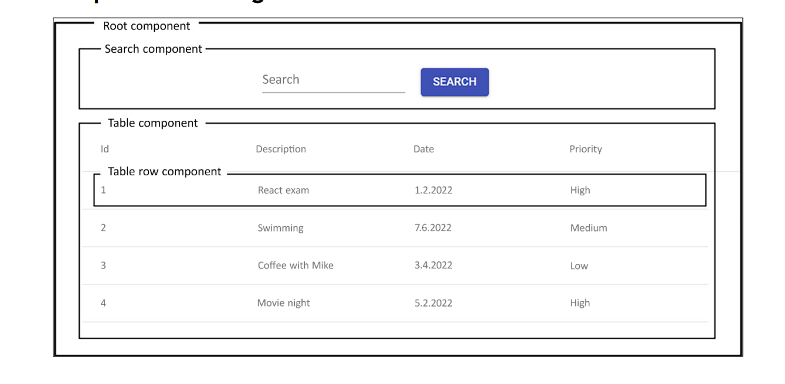

스스로 푸쉬하기

## 순서
git init<br>
git config user.name "아이디"<br>
git config user.email "이메일"<br>
git add .<br>
이후 git commit 부터 복사 붙여넣기<br>

# vs code react extension 설정
1. ESlint
    - JavaScript용 오픈 소스 린터로, 소스 코드에서 문제를 찾아 빨간줄을 그어준다.
2. Reactjs code snippets
    - 자동완성 및 단축어 지원

# React 앱 만들기 및 실행
vite project를 사용할것이다. Next.js나 Remix와 같은 다른 리액트 프레임워크가 존재하지만, 기초 학습용으로 낫다.<br>
예전에는 CRA(Create React App)을 가장 많이 사용했으나 React19에서는 공식적으로 지원 중단.
- vite는 quick이라는 의미가 있는 프랑스어

## react 앱 만들기 process
1. vs code 상에서 ctrl + shift + `(백틱)으로 터미널을 연다.
2. npm 명령어를 사용할것이다.(우리는 4.4 버전)
`npm create vite@4.4`
    - 위의 명령어가 안돌아간다면 node.js가 없는것
    - `node -v, node --version` / `npm -v , nom --version` 으로 있는지 확인
3. chrome에서 node.js - LTS 버전 다운, LTS란 오랜 기간 안정적이었다는 뜻
    - 설치후 vs코드 껐다 킨뒤 버전 확인
    - 그래도 안되면 git bash 터미널로 열어서 확인할것
4. `npm create vite@4.4` 
    - y눌러서 ok to process
    - 수업 기준으로 framework 선택하는 부분에서 react
    - variant는 JavaScript
    - 그러면 막 설치한 다음에 리눅스 명령어 몇개가 나온다.
        - cd 프로젝트명
        - `npm install` : 매우 중요
            - SpringBoot 상에서 build.gradle에 있는 의존성들 목록이 있는 것처럼 react 프로젝트에는 package.json이라고 하는 곳에 의존성 목록들이 존재한다. 그것들을 설치해야 프로젝트가 실행 가능하다.
        - `npm run dev` : 실행시키기 위한 명령어(커스텀가능)
        - 이상의 수업에서 수강생들이 많이 하는 실수 목록
            1. 오랜만에 스프링부트 했을 때 왜 실행이 안되나 했을 때와 동일<br>
            root 폴더를 프로젝트 폴터로 잡아야 실행이 된다.

## React 앱 debugging 하기
1. chrome -> react developer tools를 검색 -> 설치 후에 chrome 재실행
2. react project 상에서 f12를 통해 개발자 모드를 진입하면 저희 js 배울 때 console있는 부분 맨 끝에 무슨 보라색인지 파란색인지 리액트 아이콘 있는 Compoenets라는 애가 새로 생겼다. 이는 리액트 컴포넌트 트리가 시각적으로 표현되며, 검색창을 이용해서 특정 컴포넌트를 검색하는 것이 가능하다.
3. Console 파트에서 JS 코드의 메시지, 경고, 오류를 확인할 수 있다.
4. Network 파트에서는 저희가 SpingBoot에서 봤던 401/404/500 등의 요청 및 응답을 확인할 수 있다.

# Starting React

## React Component 만드는 법
리액트는 UI를 위한 JS 라이브러리에 해당한다(프레임워크/라이브러리의 의미는 다양하긴 하다.)<br>
15버전 이후부터는 MIT 라이선스에 따라 개발되는 중이다. 리액트는 독립적이고 재사용이 가능한 컴포넌트를 기반으로 작동하는 프레임워크라고 정의할 수 있다.<br>




이상의 구조를 바탕으로 설명한다.

현재 이미지에서 root 컴포넌트에는 검색 컴포넌트와 표 컴포넌트라는 두 개의 하위 컴포넌트가 존재하낟. 그리고 표 컴포넌트에는 표-행 컴폰느트라는 하위 컴포넌트 하나가 존재하낟. 리액트에서 이해해야 할 중요한 점은 **데이터의 흐름이 상위 컴포넌트에서 하위 컴포넌트로 일방향 이동한다는 점** 이다. Props를 통해 상위 컴포넌트에서 하위 컴포넌트로 데이터를 전달하는 방법 수업 예정

- React는 UI를 선택적으로 다시 랜더링하기 위해서 VDOM(Virtual Document Object Model)을 이용한다. 이는 DOM이 웹페이지의 구조화된 객체 트리 구조로 표현하는 웹 문서용 프로그래밍 인터페이스를 의미, 각 트리의 객체는 문서의 일부에 해당한다. 그래서 저희의 .html 파일들을 보면 들여쓰기가 왕창 되어있다. 그리고 개발자들은 DOM을 이용하여 문서를 만들고, 구조를 탐색하고, element와 컨텐츠를 추가, 수정, 삭제하는 것이 가능했었다(todolist를 떠올리면 된다). 그런데 VDOM은 경량화된 DOM에 해당하는데, 매번 전체 정보를 다 불러오는 DOM과 달리 VDOM의 경우 값이 바뀐 부분만 들고 온다.(즉 전체vs갱신된 부분만 불러오기)<br>
VDOM이 업데이트된 후 리액트는 업데이트가 실행되기 전의 VDOM의 스냅샷과 비교한 후, 변경된 부분만 실제 DOM에 업데이트하는 과정을 거치게 된다.

- React 컴포넌트는 함수 컴포넌트인 JS함수 또는 클래스 컴포넌트인 ES6 JS 클래스를 통해 정의할 수 있다.

- 이하는 Hello World 텍스트를 렌더링하는 코드의 예시이다.
```jsx
function App {// 함수이름, 당시에는 소문자로 시작하는 카멜 케이스였지만, 이건 대문자로 시작하는 파스칼 케이스
    return <h1>Hello World!</h1>
}
```
- React 컴포넌트는 return이 필수이다.
- 우리는 안쓰겠지만 ES6의 클래스를 이용하여 컴포넌트를 생성하는 방법도 있다.

```jsx
class App extends React.Componenet{//자바적으로 여겨지는 코드
    render() {
        return <h1>Hello World !</h1>
    }
}
```

첫 번째 코드블록을 함수 컴포넌트 / 두 번째를 클래스 컴포넌트라는 표현을 쓰낟. 수업 상황에서는 함수 컴포넌트를 기본적으로 상요할 것이다.<br>
이걸 굳이 수업한 이유는 React 16.8 이전에는 함수 컴포넌트 작성이 불가능했고 클래스 컴포넌트만 사용가능 했기 때문이다.

- 참고 사항 # 1 : 일반적인 JS 함수와의 차이를 두기 위해 React 컴포넌트는 파스칼케이스로 명명
- 참고 사항 # 2 
```jsx
return (
    <h1>Hello World!</h1>
    <h2>This is my First React App</h2>//에러
  ) // return은 하나의 요소만 반환할 수 있다. 여러 요소를 반환하려면 부모 요소로 감싸야 한다.
  // 즉 트리처럼 맨 위에 하나만 남게 감싸야한다.
```
 C:\kimseungil\korit_12_react\myapp\src\App.jsx: Adjacent JSX elements must be wrapped in an enclosing tag. Did you want a JSX fragment <>...</>? (5:4)
  8 |

- 만약에 컴포넌트가 다수의 html 태그 요소를 return 한다면 하나의 상위 요소 안에 넣어줘야 한다. 
```jsx
//옛날 방식
export default function App() {

  return (
    <div>
        <h1>Hello World!</h1>
        <h2>This is my First React App</h2>//에러
    </div> // 블록, 인라인은 span
  ) 
}
```

- 근데 div는 사실 여기서 하는 일이 없다. 그래서

```jsx
//지금
export default function App() {

  return (
    <>
        <h1>Hello World!</h1>
        <h2>This is my First React App</h2>//에러
    </> 
  ) 
}
```

- div를 쓰지 않는다.

## JS review
### 상수 vs. 변수

1. 상수 : const 선언자를 통해서 사용. 값 재할당 불가능.
2. 변수 : let 선언자, 값 재할당 가능 (var는 여기서 사용 안할것)

- const는 블록 범위로 제한된다. 즉, const는 해당 변수가 정의된 블록 내에서만 이용이 가능하다(즉,전역이 아니라 지역 변수의 일종으로 볼 수 있다.)

```jsx
let count = 10;
if (count > 5){
    const total = count*2;
    console.log(total); //20
}
console.log(total); // 이건 오류
```

- const가 객체 또는 배열일 때의 예시

```jsx
const myObj = {id: 3}; // 자료형 JS이다 json,map,dictionarry 아님
객체이다.

myObj.id = 4;
```

const는 상수인데 어떻게 id 값을 변경할 수 있나?<br>
myObj는 const이지만 `myObj.id가 const이지는 않다.`

### Template Literal
일반적으로 문자열을 연결하는 예시

```jsx
let person = {
    firstName : 'Jone',
    lastName : 'Doe'
}

let greeting = 'Hello ' + 'firstName' + ' '+ 'lastName';
```
템플릿 리터럴은 기억이 안날 수도 있지만 python에서의 f-string을 기억해달라

템플릿 리터럴 적용 예시

```jsx
let person = {
    firstName : 'Jone',
    lastName : 'Doe'
}

let greeting = `Hello ${person.firstName} ${person.lastName}`; //참고로 백틱이다.
```

템플릿 리터럴이란 이름이 어렵지 아는 개념이다.

### 객체 구조 분해
객체 구조 분해를 이용하면 객체에서 값을 추출하여 변수에 할당할 수 있다. 단일 구문을 이용하여 객체의 여러 속성을 개별 변수에 할당하는 것도 가능하다.

```jsx
let person = {
    firstName : 'Jone',
     lastName : 'Doe',
     email : '니알아뭐하게@n.com'
}
```

Jone이라는 String data를 가지고 오고 싶다면 기본적으론

```jsx
let firstName = person.firstName;
```

그렇지만 properties가 늘어나면 늘어날 수록 귀찮을것 같다.

그래서 객체 구조 분해가 등장하였다.

```jsx
const {firstName,lastName,email} = person;
```
이상의 의미는 _처음으로_ firstName, lastName, email 이라고 하는 세 개의 변수를 선언하고, 극 ㅏㅄ을 person 객체의 동일한 key를 지니고 있는 데서 valuer를 빼와서 대입한다는 의미가 된다. 이해가 안된다면

```jsx
const firstName = person.firstName;
const lastName = person.lastName;
const email = person.email;
```
을 한줄로 고친것이라 생각할것

### 클래스 / 상속

- ES6의 클래스 정의는 Java와 C#같은 다른 객체 지향 언어들과 유사하다.

```jsx
class Person {
    constructor(firstName, lastName){
        this.firstName = firstName;
        this.lastName = lastName;
    }
}
```

이상의 코드 예시에서는 클래스 정의 방법과 AllArgsConstructor를 정의하는 방법, 그리고 필드 선언 방식을 작성해두었다. 그리고 method도 있을 수 있지만 여기서는 생략

```jsx
class Employee extends Person {
    constructor(firstName, lastName,title,salary){
        super(firstName,lastName)
        this.title = title;
        this.salary = salary;
    }
}
```

그러면 Java/Python 과 유사한 점과 차이점을 알 수 있다.
super()의 경우에는 Java와 완전히 일치하는 것을 확인할 수 있다.
생성자의 매개변수 내에 자료형이나 선언자가 없다는 점은 python과 일치

### Arrow Function
- 일반적인 함수를 정의하는 방법은 function 키워드를 사용하는 것이다.
- Component 작성시에도 사용한다.

```jsx
function(x) {return x*2;}
```
근데 이걸 화살표 함수로 작성하면
```jsx
x => x*2;
```
이렇게 쓴다. (-가 아니라 =다, 세상에...)

이는 익명 함수의 일종으로, 이 함수 자체를 호출할 수가 없다.(함수명이 없기 때문에)<br>
하지만 이 익명 함수의 사용처는 주로 다른 함수의 argument로 기능한다.<br>
그리고 let 선언자 이후에 함수를 변수명에 저장할 수 있었다는 점과 합치게 되면 원래는 호출이 불가능했던 익명 함수의 호출이 가능해진다.

```jsx
const calc = x => x*2;
```

이상의 경우가 arrow function을 calc라고 하는 상수명에 대입한 예시가 된다. 이 경우 함수를 이하와 같은 방식으로 호출할 수 있다.

```jsx
calc(5) // 10이 리턴
```

1. 매개변수가 둘 이상인 경우에는 소괄호를 사용해야 한다.

```jsx
const calcSum = (x,y) => x + y ;

calcSum(2,3) ;
```

2. 함수 본문이 표현식인 경우 return을 명시할 필요가 없다.
하지만 함수 구현부의 여러 줄에 해당하는 경우에는 {}와 return이 명시되어야 한다.
```jsx
const calcSum = (x,y) => {
    const.log('결과를 계산중')
    return x+y;
} // 중괄호가 있다면 return을 명시해야한다.
```
- 한줄이어도 {}가 있다면 return이 필요하다.
- {}안쓰고 두 줄 쓰면 오류
- 두 가지 사항을 다 합쳤을때, 한 줄인데 {}없고 , return을 요구하는 표현식인 경우에는 return 안써도 된다.
하나라도 빠질경우 return이 요구된다.

3. 매개변수강 ㅓㅄ다면 비어있는 ()가 요구된다.

```jsx
const sayHello = () => 'Hello !';
console.log('${sayHello} Jone !');
```

리뷰 끝

## JSX와 스타일링
- JSX는 JavaScipt XML의 축약어(eXtended Markup Language)
이 개념에서 제일 자주 쓰이고 중요한것은 {}를 사용하여 JS 표현식을 JSX에 표현할 수 있다는 점이다.
추후 예시 제공

이하는 JSX로 컴포넌트의 프롭에 접근하는 방법
```jsx
function App(props){
    return <h1>Hello World {props.user}</h1>
}
```

근데 여기에 JS 표현식도 전달이 가능하다.

```jsx
<Hello count={2+2}/> // 컴포넌트 임을 알 수 있다<대문자 시작>
```

JSX 요소에는 inline 스타일링과 외부 스타일링 방식이 다 가능하다.

```jsx
<div style = {{height: 20, width: 200}}>
    Hello    
</div> // 리액트의 골때리는 점
// 바깥 대괄호 = 여기 안에 js로 쓸것이다.
//근데 안에 js 객체를 쓸건데, js객체는 대괄호로 감싸서 만든다.
// 그렇기에 대괄호를 두번씩 쓰는 일이 발생한다.
```

```jsx
const divStyle = {
    color : 'red',
    height : 30
    };
const MyComponent = () => {
    <div style={divStyle}>Hello World!</div>
}

```

### props / state

props와 state는 컴포넌트를 렌더링하기 위한 입력 데이터에 해당한다. props나 state가 변경되면 컴포넌트가 다시 렌더링 된다.
- 렌더링 = 컴퓨터 그래픽을 그려내다.

1. props(프롭)
    - 컴포넌트에 대한 입력이며, 상위 컴포넌트에서 하위 컴포넌트로 데이터를 전달하는 메커니즘에 해당한다.
    props는 자료형은 JS객체이다. 그 말은 key-value properties로 이루어져 있다. 그렇기 때문에 여러개의 key-value pair르 보내는 것이 가능하다.

    - props는 불변이므로 컴포넌트는 props를 변경하는 것이 불가능하다. 그리고 그 props 개념은 상위 컴포넌트로부터 받는다. 컴포넌트는 함수 컴포넌트에 매개변수로 전달되는 props 객체를 통해 전달가능하다.

예시
```jsx
function Hello(){
    return <h1>Hello 김일</h1>
}
```
을 만든다고 가정하겠다.

그리고 Hello 컴포넌트를 불러오기 위해서 main.jsx에 추가

```jsx
import React from 'react'
import ReactDOM from 'react-dom/client'
import App from './App.jsx'
import Hello from './Hello.jsx'
//import './index.css' 초기화를 하라고 하면 이거 지워야 하낟.

ReactDOM.createRoot(document.getElementById('root')).render(
  <React.StrictMode>
    <App />
    <Hello />
  </React.StrictMode>,
)

```

이상의 코드는 Hello 김일 이라는 정적 메시지를 렌더링할 뿐이며 재사용할 수가 없다. 하드코딩된 이름을 이용하는 대신에 props를 활용하면 Hello 컴포넌트에 일므을 전달하는 것이 가능하다.

```jsx
import Hello from './Hello.jsx';

export default function App() {
  return(
    <>
      <Hello user='김일' />
      <Hello user='김영' />
      <Hello user='김남궁' />
    </>
  );
}
```
아까 main.jsx를 수정했지만 기본적으로는 App.jsx를 가장 상위로 두고, main.jsx에는 App 컴포넌트만 존재하는게 이상적

```jsx
import Hello from './Hello.jsx';

export default function App() {
  return(
    <>
      <Hello firstName='Jone' lastName='Doe' />
      <Hello firstName='Gildong' lastName='Hong' />
    </>
  );
}

export default function Hello(props) {
  return <h1>Hello {props.firstName} {props.lastName}</h1>
}
```
- 이상의 코드에서 고려할 점은 props가 JS객체라고 했기 때문에 처음 JS 객체 배웠을 때 처럼 key를 개발자 마음대로 정의할 수 있다는 점이다. 그리고, properties의 수도 마음대로 정할 수 있다. 처음 예시에서는 `user`라고 하는 key에 김일을 대입했었고, 두번째 예시에서는 `firstName`,`lastName`이라고 하는 key에 각각 Jone과 Doe라고 하는 value를 대입해서 상위컴포넌트(App)에서 하위컴포넌트(Hello)로 보내줬다. 즉, App 컴포넌트가 렌더링 될 때, 정해진 firstName/ lastNAme의 key의 value를 Hello 컴포넌트가 받아서 return으로 `렌더링` 했다고 볼 수 있다.

```jsx
export default function Hello({firstName, lastName}) {
  return <h1>Hello {firstName} {lastName}</h1>
}
// props는 객체이므로 구조분해할당으로 바로 꺼내서 사용할 수 있다.
```
- 이상의 코드는 예약어인 props 대신에 Hello 컴포넌트의 매개변수로 애초에 destructuring된(객체 구조분해된) 변수들인 firstName, lastName을 집어넣었다. 그말은 props 내에 있는 key-value properties가 firstName / lastName이라는 key를 가지고 있다는 뜻이 된다.<br>
그렇기 때문에 아까 복습란에 적은것 처럼 `객체면.키이름`이 아니라 `키이름` 만으로 value를 불러오는 것이 가능하게 된다.<br>
props를 반복해서 쓰기 싫은 경우에 구조분해를 적극적으로 도입해볼만 하다.

2. state
- 리액트에서 컴포넌트의 _상태_ 는 시간의 변화에 따라 변경될 수 있는 정보를 보고나하는 내부 데이터 저장소를 의미한다. 그리고 이 상태는 컴포넌트의 렌더링에도 영향을 준다. 상태의 값이 바뀌게 되면 리액트는 그 상태가 포함되어있는 컴포넌트를 리렌더링하게 된다.
그러면 상태는 최신값을 유지하게 된다.<br>
이 개념은 컴포넌트가 사용자 상호작용이나 기타 이벤트에 동적으로 반응할 수 있도록 해준다.

* 참조 : 일반적으로 리액트 컴포넌트에 불필요한 상태를 도입하지 않는 편이 좋다. 복잡성이 증가하고 부작용이 일어날 수 있기 때문이다.
그런경우에는 상태가 아니라 let을 통한 변수의 도입이 더 나을 수 있다. 근데 변수의 값 변경은 리렌더링이 일어나지 않는다는 점을 명심할 필요가 있다.

- 상태의 값이 변경되면 리렌더링이 일어난다.
- 변수의 값이 변경되는 것은 리렌더링이 일어나지 않는다.

상태는 'useState' 훅 함수를 이용하여 만들 수 있다.(hook 개념은 추후 설명, 여기서는 react에서 상태를 선언하기 위해 사용한다고 알아둬라).
이 함수는 상태의 초기값인 argument를 하나 받고, 두 element로 구성된 배열을 반호나한다. 첫 번째 element는 상태의 이름이고, 두 번째 element는 상태 값을 업데이트 하는데 이용되는 함수이다. 

```jsx
const [ state, setState] = useState(intialValue);
```

- 예시 # 1
```jsx
const [ name, setName ] = useState('김영');
```

이상과 같이 선언했을 경우, name이라고 하는 _상태_ 와 상태의 값을 변경할 수 있는 _setter_ 를 동시에 정의한다고 볼 수 있다.
다 합치면, 최초에 name이라는 상태에 '김영'이라는 값이 저장되어 있는데, setName을 사용하게 되면 그 '김영'을 다른 이름으로 바꿀 수 있다는 것이다.
그리고 그 값이 바뀌게 될때마다(즉, setName()이 호출될때마다) 컴포넌트의 리렌더링이 일어난다고 생각할 수 있다.

그러면 setName을 호출하는 방식은 이하와 같다.
- 예시 # 2
```jsx
setName('김일');
```
- 근데 setName()이 함수인 걸 어떻게 알 수 있나 ? 가 문제가 된다. 이것 때문에 아까 함수 선언 방식을 복습했다.

```jsx
function setName(name) {this.name = name;}
```

위처럼 쓰는게 아니라

```jsx
const setName = () => (this.name = name;)
```
과 같은 함수 표현식을 통해서 정의한 결과물이기 때문에
`const [name, setName] = useState('김영');` 처럼 쓰더라도 '아 동사인 set으로 시작했으니까 함수겠구나' 하고 넘어가야한다.

어쨋든 setName()을 호출하면 리렌더링이 일어난다. 하지만 `name = '이이';` 와 같이 변수 대입하는 방식으로 처리하면 리렌더링이 일어나지 않는다.

차이점에 꼭 주목하자.

그리고 useState()내의 argument는 매우 중요한 의미를 가진다. 예를 들어 이상의 경우에는 '김영'이라고 했기 때문에 name 상태에는 string 자료형만 들어갈 수 있다. 즉

```jsx
const [number, setNumber] = userState(2026);
```
이라고 작성했다면
```jsx
setNumber('이천이십육년');
```
이라고 작성할 경우에 오류가 난다. 즉, initialValue의 자료형을 고려할 필요가 있다.<br>
이를 응용할 경우 다양한 변형이 가능하다.

```jsx
const [name, setName] = useState({
    firstName : 'jone',
    lastName : 'doe'
})
```
와 같이 작성했다면, useState()의 initialValue가 JS객체이기 때문에 setName() 함수를 사용할 때도 자료형을 일치시켜줘야 한다.

```jsx
setName({firstName : '삼',lastName : '김'});
```

과 같은 방식으로. 그런데 김사로 바꾸고 싶으면 firstName만 고치면 되는데 lastName까지 입력해야한다는 문제가 있다

그 경우
```jsx
setName({...name,firstName : '사'});
```
라고 작성하면 된다.<br>
`...`은 스프레드 연산자이다. 배열과 객체에서 사용된다.
- 명시되지 않은 나머지는 그대로 둔다는 의미이다.
- 객체의 부분 업데이트를 수행한다.

리렌더링은 전체가 아니라 부분적으로 이루어지는 렌더링이다.

```jsx
import { useState } from "react";

export default function MyComponent() {
  //훅 함수는 최상단에 선언되어야 한다.
  const [firstName, setFirstName] = useState('김영');
  
  return(
    <>
      <div>Hello {firstName}</div>
    </>
  );
}
```
- 이상은 useState()를 사용한 컴포넌트를 생성한 예시이다.(리렌더링이 일어난다. )
