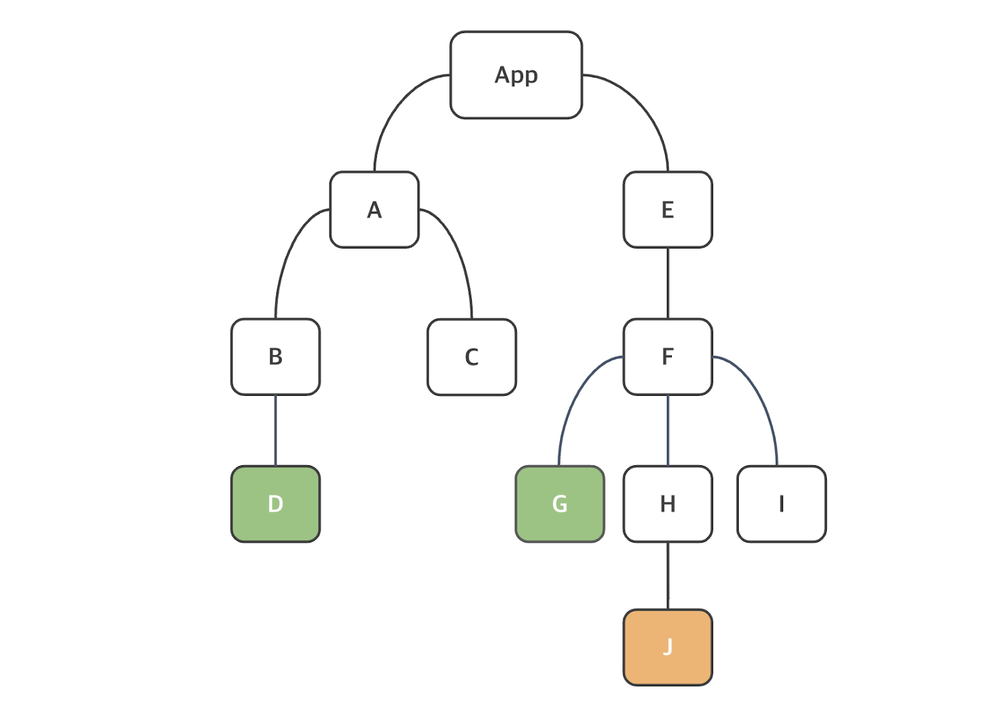

## 어제한것 리뷰
- 객체 스프레드 연산자
- 객체의 properties를 업데이트하거나 복사할 때 사용
```jsx
let user = { lastName: '김', firstName: '영', city: '부산'}

//파이썬의 딕셔너리 느낌, 키와 밸류가 있으니까
user['age'] = 20;

user = {...user,school: '코리아아이티고등학교'}
```

`...객체명/배열명`의 경우 기본적으로 내부 element의 자료형과 property(객체의 경우)의 key-value pair를 고려할 필요가 있으며, 배열 자체 혹은 객체 자체가 아니라는 점을 명시해야한다.

- 객체를 이용한 상태(state)
- 상태의 initialValue를 객체 형태로 집어넣었을 경우 set객체명의 이용법은 이하와 같다.

```jsx
const [ name, setName] = useState({firstName : '영', lastName : '김'});

//setter 복습
setName({...name,firstName:'일'});

return <h1>Hello {name.firstName}</h1> //Hello 일 이 return / {name ['firstName']} 형태도 가능
```

## 상태 비저장 컴포넌트(Stateless Component)
- 상태가 없는 컴포넌트

Props를 argument(인자)로 받아서 리액트 요소를 return하는 순수 JS 함수이다. 이하는 예시이다.

```jsx
function HeaderText(props){
  return(
    <h1> {props.text} </h1>
  )
}
```
와 같이 작성되어 있다면 상위 컴포넌트에서 `<HeaderText text='어쩌고' />`라고 작성되어있다고 추론할 수 있다.

이상의 예시는 pure Component라고 한다. 순수 컴포넌트의 정의는 '동일한 입력값이 주어졌을 때 return되는 값이 일관되게 동일한 컴포넌트'이다.
이런 순수 컴포넌트를 리액트에서는 성능 최적화를 하기 위해 Reacrt.memo()라는 것을 지원한다.

```jsx
function HeaderText(props){
  return(
    <h1> {props.text} </h1>
  )
}

export default memo(HeaderText);
```

이상과 같이 작성했을 경우 컴포넌트가 렌더링된 다음에 메모이제이션 된다.<br>
다음 렌더링에서 리액트는 props가 변경되지 않으면 메모될 결과를 렌더링한다.<br>
즉 React.memo() 구문에서는 렌더링 조건을 사용자 정의하는 데 이용할 수 있는 arePropsEqual()과 같은 argument도 존재하긴 하지만 여기서는 다루지 않는다. <br>
다만 메모이제이션이라는 개념은 성능 최정화를 위해서 동일한 결과값이 존재한다면 고려해볼만한 요소

## 조건부 렌더링

```jsx
export default function MyComponent2(props){
  const isLoggedin = props.isLoggedin; // 계속 props 붙이기 귀찮아서 상수 선언 -> 객체구조분해를 쓴다면 상관없음

  if (isLoggedin){
    return(<Login/>)
  }

  return (<Logout />)
}
```

이상의 코드를 이하의 코드처럼 삼항연산자로 바꿀 수 있다.

```jsx
import Login from "./Login";
import Logout from "./Logout";  

export default function MyComponent3({isLoggedin}){
  return(
    <>
      {isLoggedin ? <Login /> : <Logout />}
    </>
  )
}
```

## React Hook

Hook 개념은 React 16.8부터 도입되었다. 훅을 이용하면 함수 컴포넌트에서 상태와 리액트의 다른 기능을 이용하는 것이 가능하다. 훅이 생기기 전에는 컴포넌트 로직이 필요한 경우에 클래스 컴포넌트를 써야 했다.
- 리액트를 쓸거라면 웬만하면 최신이 도입되어있기 때문에 우리나라에서는 고려 사항이 좀 안되는 편이다.

### Hook 사용에서의 중요 규칙
1. 함상 리액트 함수 컴포넌트의 최상위 수준에서 Hook을 호출해야 한다. : 첫 번째 {} 내에서 호출한다.

2. 조건문 , 반복문, 중첩 함수 내에서 훅을 호출해서는 안된다.

3. 훅 이름은 use로 시작하며, 그 뒤에 훅을 이용하는 목적이 따라온다.<br>
useState라면 상태를 다루는 hook임을 명시한것

## useState
- App5.jsx를 만들고 app.jsx에 있는거 붙여넣기


```jsx
import { useState } from 'react';

export default function Counter(){
  //초기값이 0인  count 상태 선언 및 초기화 
  const [count, setCount] = useState(0);
  return (
    <div>
      <p>Count = {count}</p>
      <button onClick={() => setCount(count + 1)}> 
        Increment
        </button>
    </div>
  )
}

```

- 상태를 선언하는 데 사용되는 useState 함수를 활용하여 버튼을 누를 때 마다 count가 1씩 증가하는 예제를 작성했다. 여기서 필요한 개념들을 학습하겠다.

1. 리액트에서의 이벤트명은 카멜케이스(onClick)로 작성하낟. html상에서는 onclick.<br>
: 별개의 이벤트명이기 때문에 자동완성을 했을 경우 JS 변수를 불러올 수 있는 {} 가 생성되는 것도 확인할 수 있다.

2. `onClick={() => setCount(count+1)}`에 주목, 왜 `onClick = {setCount(count+1)}`이 아닐까
  - 함수인것과 아닌것의 차이로 보이는데
  - '함수' 이벤트 핸들러 에 전달되어야 하며, 사용자가 버튼을 클릭할때만 리액트가 함수를 호출해야 한다. 이상의 예제에서는 function 키워드로 함수 정의한게 아니라 arrow function을 통해서 익명함수로 작성해놨다. ( 그리고 함수 표현식으로 변수에 대입하지 않았다.) 이벤트 핸들러 안에서 함수를 '호출' 하게 되면 컴포넌트가 렌더링될때 함수가 호출되어 무한 루프가 발생하게 된다.

```jsx
<button onClick={() => setCount(count+1)}> // 함수가 버튼을 눌렀을 때 호출

<button onClick = {setCount(count+1)}> // 함수가 렌더링 될때 호출되어 결과값이 바뀜 -> 상태가 바뀌었기 때문에 리렌더링 -> 함수가 호출 (이하가 무한반복)
```

- 그런데 상태의 업데이트는 비동기적이므로 새 상태 값이 현재 상태 값에 달라질 수 있다. 그래서 최신값을 확보한다는 것을 명심하기 위해서는 
`<button onClick = {() => setCount((preValue) => preValue + 1)}>`
- App3에 있음
- 조금더 안정적이다.


### 일괄처리(Batching)

```jsx
import { useState } from 'react';

export default function Counter(){
  //초기값이 0인  count 상태 선언 및 초기화 
  const [count1, setCount1] = useState(0);
  const [count2, setCount2] = useState(0);

  const inCrement = () => {
    setCount1(prevCount1 => prevCount1 + 1); // 아직 재렌더링이 일어나지 않음, 원랜 바뀌자마자 재렌더링이 일어나서 setCount2가 일어나지 않아야 하는데
    setCount2(prevCount2 => prevCount2 + 1); // 즉 하나로 묶어놓으면 재렌더링이 안되게 막을 수 있다.
    // 모든 상태가 업데이트되고 나서 컴노넌트 재렌더링됨, 근데 리렌더링이 재렌더링인가
  }
  return (
    <>
      <p>Count : {count1} | {count2}</p>
      <button onClick={inCrement}>증가</button>
    </>
  )
}
```

- 이상의 코드에서 주목할 부분은 React 버전 18 이하에서는 일괄처리가 버튼 클릭 같은 브라우저 이벤트 중 일부에서만 가능했었다는 점이다.
- 즉, 위의 코드에서 setCount1()이 호출되는 시점에 count1의 상태가 변경되었기 때문에 기존에 알던 state 정의에서 재렌더링이 일어나야 하지만, onClick 이벤트 중이기 때문에 재렌더링이 일어나지 않았고ㅓ, setCount2()까지 호출되고 나서야 전체 컴포넌트가 재렌더링 수행되었다고 해석할 수 있다.

- React버전 18이후부터는 모든 상태 업데이트가 일괄처리되낟. 그래서 일괄처리를 하지 안혹 싶은 경우에만 커스텀해야하는데 fluchSync API라는 것을 추가로 사용해야 하는데, 이를 이용할 경우, 다음 상태를 업데이트 하기 전에 일부 상태하려는 경우가 있을 수 있는데, 보통은 브라우저 API와 같은 서드 파티 코드를 합칠 때 유용하게 사용된다. -> 근데 리액트 앱 전체 성능에 영향을 줄 수 있으므로 필요한 경우에만 사용해야 해서 본시 수업에선 다루지 않는다.

### useEffect - 머리아픈것
- 리액트 함수 컴포넌트에서 보조 작업(side-effect)을 수행하는 데 이용할 수 있다. 주로 사용하는 것은 fetch 요청에서이다.<br>
형식은 이하와 같다.
- 형식<br>
`useEffect(callback,[defendencies])`
- 첫 번째 argumetn인 callback 함수는 보조 작업 로직(ex : fetch해서 외부 api를 가지고 오는등)이 포함되어 있으며, [depedencies]는 의존성을 포함하는 배열로 optional

- Counter3.jsx를 생성하고, Counter의 내용을 그대로 붙여넣기 한다.

```jsx
import { useEffect, useState } from 'react';

export default function Counter3(){
  const [count, setCount] = useState(0);

  useEffect(() => console.log('Hello from useEffect')); 
  return (
    <div>
      <p>Count = {count}</p>
        <button onClick={() => setCount(prevCount => prevCount + 1)}> 증가 </button> 
    </div>
  )
}
```

- `useEffect(() => console.log('Hello from useEffect'))` : 두 번째 argument가 없는 상태이다.<br>
그렇다면 따로 의존성이 없는 상태기 때문에 useEffect()를 안썼을 때와 동일하다.<br>
즉 재렌더링이 일어날때마다 첫 번째 인자인 callback 함수가 호출된다. 개발자 도구(f12)의 console에서 확인가능

- useEffect에는 콜백함수가 _모든 렌더링에서 실행되는게 아니라 선택적으로 실행할 수 있는_ 의존성 배열을 두 번째 agument로 갖는다. 이하의 예시는 count 상태값이 변경되면, 즉 이전 값과 현재 값이 달라지면 userEffect가 호출도리 수 있도록 정의한다. 그리고 두 번째 argument는 배열이기 때문에 내부에 여러 상태를 정의하는 것도 가능하다. 그 경우 상태값중 하나라도 변경되면 useEffect 훅이 호출된다.

- `useEffect(() => console.log('Hello from useEffect'), [count]);` : count 상태가 바뀔때마다 useEffect()내의 callback 함수가 호출된다.

- 근데 의존성배열과 별반 차이가 없어서 counter4에서 명시적으로 볼 수 있겠금 작성

`useEffect(() => {console.log('count1 상태가 변경되었습니다.')},[count1]);` - 이 경우 count2가 바뀌어도 재렌더링이 일어나지 않는다.

`useEffect(() => {console.log('첫번째 렌더링 시에만 useEffect의 callback 함수가 호출')},[]);`

### useRef - 레퍼런스에서 따옴
- DOM 노드에 접근하는 데 이용할 수 있는 _변경 가능한 ref 객체_ 를 return 한다.
- 형식
`const ref = useRef(initialValue);`

- return된 ref 객체에는 전달된 argument로 초기화도니 현재 속성(current initialValue)이 있다.
이하에서는 inputRef라는 ref 객체를 생성한 다음에, null로 초기화를 해둘것이다. 다음에 JSX 요소의 ref 속성을 이용하여, input 요소의 focus 함수를 실행하도록 할것이다. 즉 DOM 조작과 관려노딘 복습이 전제되어 있지 않다면 useRef를 자주 쓰지 않을 확률이 있다.

```jsx
import './App.css';
import { useRef } from 'react';

export default function App(){
  const inputRef = useRef(null);

  return (
    <>
      <input type="text" ref={inputRef}  />
      <button onClick={() => inputRef.current.focus()}>Focus Input</button>
    </>
  )
}
```

이상의 코드 내용을 보고 input 태그에 딸려있는 속성을 불러ㅓ내는 과정을 공부하면 된다 즉, 태그마다 useRef의 사용법이 다르게 굴러갈 수 있다.

### custom Hook - 사용자 정의 훅
리액트에서 사용자 정의 훅 함수를 정의하는 것이 가능하다. Hook의 조건에서처럼 use로 시작해야하며, 기본적으로는 JavaScript 함수이다. 그리고 여태까지 배운 것처럼 함수 내에서 다른 함수를 호출할 수 있듯이 hook 내에서 다른 hook을 호출하는 것도 가능하다. 이를 이용하면 컴포넌트의 복잡성을 줄이고 재사용성이 늘어날 수 있다.

예시 - title 태그의 값을 바꾸는 DOM 조작 관련 훅 함수를 생성하겠다.

- useTitle.js 생성
- 동적으로 변화되는것을 보여주기 위해 counter 사용 : Counter5.jsx 생성
- App.jsx 상위에 Counter5 컴포넌트 불러오기

```jsx
import { useEffect } from "react";

function useTitle(title) {
  useEffect(() => {
    document.title = title;
  },[title]);
}

export default useTitle;
```
- 호출시에 받은 매개변수 title이 변경 될때마다 해당 index.html의 title 태그의 값을 재대입해준다.
- useTitle이라는 사용자 정의 hook 내부에서 useEffect()라는 미리 정의되어진 hook을 ~ 

```jsx
import { useState } from 'react';
import useTitle from './useTitle';

export default function Counter5() {
  const [count, setCount] = useState(0);
  useTitle(`당신은 ${count}번 클릭했습니다.`);
  return (
    <>
      <p>Counter : {count}</p>
      <button onClick={() => setCount(count + 1)}>Increment</button>
    </>

  )
}
```

- 정의는 .js파일에 해놓고, 호출은 counter5.jsx에서 했다. useTitle은 title이라는 매개변수를 가지기 때문에 이를 템플릿 리터럴을 통해서 argument로 보냈다. 혹시 복잡하게 쓰고 싶다면

```jsx
const title = '당신은 ${count} 번 클릭했다.';
useTitle(title);
```
로 클린코드로 작성가능

## Context API - 리액트에 내장됨
- 원리는 중요하지만 아마 우리 프로젝트때는 Zustand를 쓰게 될것이다. (스스로 연구할것)
- 컴포넌트의 구조는 트리 구조를 따르고 있다. 그리고 상위 컴포넌트에서 하위 컴포넌트로 props를 전달해주는 형태를 가지고 있다.<br>
이를 미리 알고 있는 상황에서 가정할 수 있는 것은, 트리 구조가 4단으로 이루어져 있는데, 가장 상위에서 props를 전달하고, 가장 하위에서 이를 return에서 풀어준다고 했을때, 2, 3 단의 컴포넌트들은 props를 전달 받아야만 한다. 종래의 react에서는 props 전달을 2단, 3단으로 하는것이 불가능 하기 때문이다. 이를 해결하기 위한 방식이 Context API로, 전역 데이터를 이용하는 경우 도입하는 방식이다.



- 가장 상위에 App이 있다.
- D에서 받은 정보를 J에 줄 방법이 '원래의 리액트'에겐 없었다.
  - 리액트는 단방향이어서 상위로 올라갈 수 없다.


- Context API에 정보를 따로 모아서 필요한 곳에 넣게 하는게 전역 관리 기법 

```jsx
import { useState } from "react";

export default function MyComponent() {
  //훅 함수는 최상단에 선언되어야 한다.
  const [firstName, setFirstName] = useState('김영');
  
  return(
    <>
      <div>Hello {firstName}</div>
    </>
  );
}
```
- 이상은 useState()를 사용한 컴포넌트를 생성한 예시이다.(리렌더링이 일어난다. )

```jsx
import { createContext } from "react";

const AuthContext = createContext('');

export default AuthContext;0
```

```jsx
import MyComponent from './MyComponent'
import AuthContext from './createContext'
import './App.css'

function App() {
  // props drilling 말고 전달할 변수 하나 선언
  const username = 'Kim0';

  return (
    <AuthContext.Provider value={username}>
      <MyComponent />
    </AuthContext.Provider> // 이거 사이에 있는건 username을 쓸 수 있게된다.
  )
}

export default App

```

```jsx
import { useContext } from "react";
import AuthContext from "./createContext";

export default function MyComponent() {

  const authContext = useContext(AuthContext);

  return (
    <p>
        welcome {authContext}
    </p>
  );
}
```

- props drilling이 귀찮은 예시

```jsx
import MyComponent from './MyComponent'
import './App.css'

function App() {
  // props drilling 말고 전달할 변수 하나 선언
  const username = 'Kim0';

  return (
      <MyComponent username={username} />
  )
}

export default App
```

```jsx
import Hello from "./Hello";

export default function MyComponent(props) {

  return (
    <>
      <Hello username={props.username} />
    </>
  );
}
```

```jsx
export default function Hello(props) {
  return (
    <>
      안녕하세요, {props.username}
    </>
  )

}
```

- 겨우 2단이어서 어렵진 않았지만 6단정도 되면 어떨까?
- 이러니까 Context를 쓰는것이다.
- 귀찮으면 Zustand를 공부하는것이 좋다.

```jsx
//App.jsx
import MyComponent from './MyComponent'
import AuthContext from './createContext'
import './App.css'

function App() {
  const username = 'Kim0';

  return (
    <AuthContext.Provider value={username}>
      <MyComponent/>
    </AuthContext.Provider>
  )
}

export default App
```

```jsx
//Hello.jsx
import { useContext } from "react";
import AuthContext from "./createContext";

export default function Hello() {
  const username = useContext(AuthContext);
  return (
    <>
      안녕하세요, {username}
    </>
  )

}
```

```jsx
//createContext.js
import { createContext } from "react";

const AuthContext = createContext('');

export default AuthContext;
```

## React list - 사실상 map함수를 말하는것
- listeventform 이름으로 javascript / react 프로젝트 생성

```jsx
export default function MyList() {
  const data = [1,2,3,4,5]

  return(
    <ul>
      {
        data.map((elem,index) => 
          <li key={index}>List Item : {elem*2}</li> // key = {index} 는 고유한 값이어야 한다. index는 고유한 값이 아니므로 권장되지 않음
        )
      }
    </ul>
  )
}
```