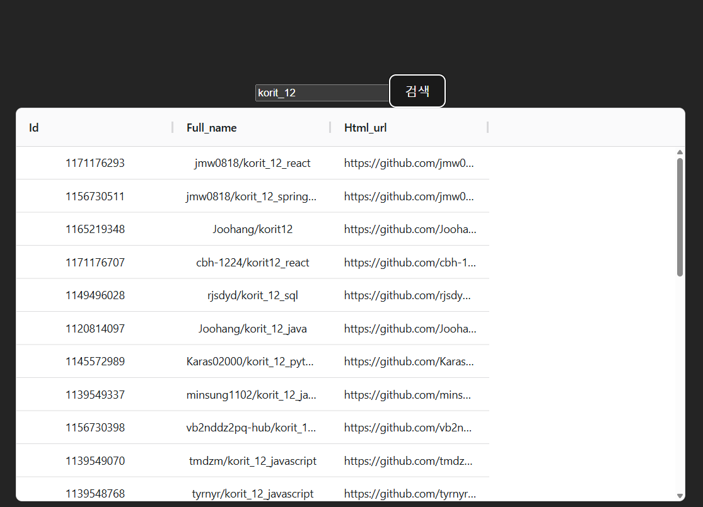
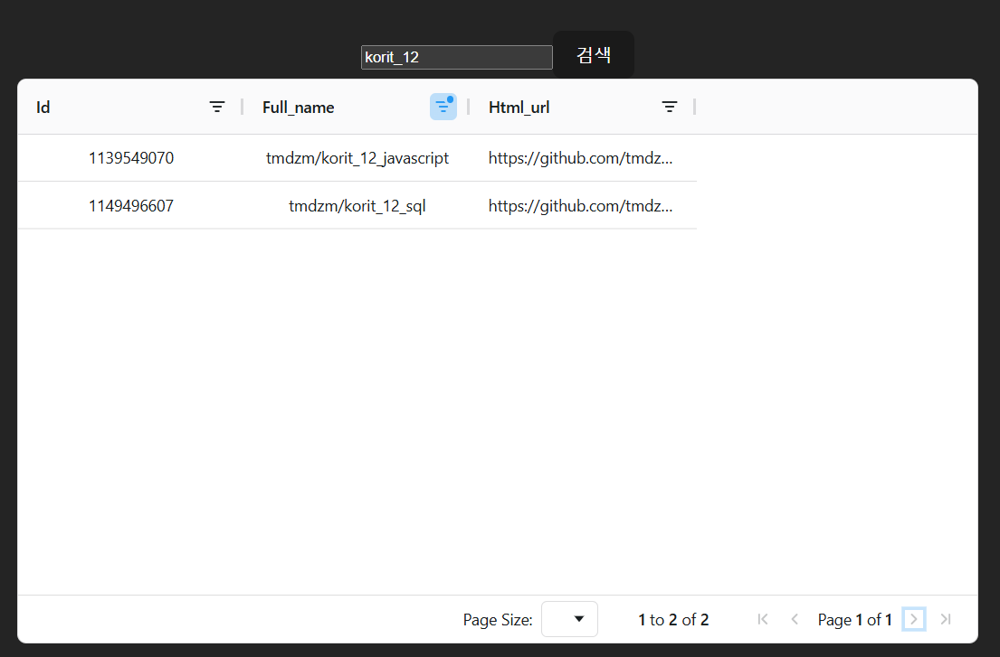

# AG Grid 이용

- AG Grid는 리액트 앱용 데이터 그리드 컴포넌트에 해당한다.<br>
스프레드 시트러처럼 데이터를 표시하는데 이용할 수 있으며 사용자 상호 작용도 가능하다. 필터링, 정렬, 피벗(행과열을 바꿈)과 같은 기능을 포함한다.

npm install ag-grid-community@30.0.1 ag-grid-react@30.0.1
- 무료 버전이라 커뮤니티
- 구 버전이니 쓰지 마라


팀장이 스프링부트와 백엔드의 디펜던시를 다 작성한뒤 뿌린걸 토대로 만들게 한다.

```tsx
import {useState} from 'react';
import axios from 'axios';
import { AgGridReact } from 'ag-grid-react';
import 'ag-grid-community/styles/ag-gird.css';
import 'ag-grid-community/styles/ag-theme-material.css';
import './App.css'

type Repository = {
  id : number; // 고유값을 통해서 나중에 .map() 적용했을 때 사용
  full_name: string;
  html_url: string;
};

function App() {
  const [ keyword, setKeyword] = useState('')
  const [ repodata, setRepodata ] = useState<Repository[]>([]);

  const handleClick = () => {
    axios.get<{items : Repository[]}>(`https://api.github.com/search/repositories?q=${keyword}`)//fetch가 아니다. get요청
    .then(response => setRepodata(response.data.items))//generic안에 객체 분해, items안의 키가 repository 배열
    .catch(err => console.log(err));
  };
  
  return (
        <div className='App'>
          <input type="text" value={keyword} onChange={(e) => setKeyword(e.target.value)}/>
          <button onClick={handleClick}>검색</button> 
          <div className="ag-theme-material"
            style={{ height:500, width: 850}}
          >
            <AgGridReact
              rowData={repodata}
            />
          </div>
        </div>
  )
}

export default App

```

- 이상의 코드에서 `<AgGridReact rowData={repodata}/>` 부분이 낯설 수 있다.<br>
ag-grid 컴포넌트에 데이터를 채우려면 컴포넌트에 rowData 프롭을 전달해줘야 한다. 객체의 배열을 데이터에 넣을 수 있기 때문에 state에 해당하는 기존에 repodata를 이용할 수 있다. 그리고 stryle  정의를 해서 div 요소로 감싸줘서

```tsx
<div className="ag-theme-material"
            style={{ height:500, width: 850}}
          >
            <AgGridReact
              rowData={repodata}
            />
          </div>
```
와 같이 작성했다. 그러면 왜 div로 감싸줘야 하는가?<br>
그렇게 만들어졌기 때문이다. https://랑 같다.

- 현재 ag-grid-community와 ag-grid-react가 버전 불일치가 발견됐다. 
1. package.json의 dependencies 파트에서 ag-gird관련 2개 삭제
2. node_modules에서 ag-grid관련 폴더 두개를 다 삭제
3. npm install ag-grid-community ag-grid-react
4. vite 프로젝트가 cashe를 가지고 있을 수 있음
  - node_modules의 .vite 폴더를 전체 삭제

npm run dev -- --force

```tsx
import {useState} from 'react';
import axios from 'axios';
import { AgGridReact } from 'ag-grid-react';
import { ColDef } from 'ag-grid-community';
import './App.css'

//themeQuartz라는 테마형식 안씀, 밑의 import에 사용
// 기본이 쿼츠

//추가된 부분
import { ModuleRegistry, AllCommunityModule } from 'ag-grid-community';

ModuleRegistry.registerModules([ AllCommunityModule ]);

type Repository = {
  id : number; // 고유값을 통해서 나중에 .map() 적용했을 때 사용
  full_name: string;
  html_url: string;
};

function App() {
  const [ keyword, setKeyword] = useState('')
  const [ repodata, setRepodata ] = useState<Repository[]>([]);
  const [ columnDefs ] = useState<ColDef[]>([
    {field: 'id'},
    {field: 'full_name'},
    {field: 'html_url'},
  ]);//컬럼이 여러개니까 배열

  const handleClick = () => {
    axios.get<{items : Repository[]}>(`https://api.github.com/search/repositories?q=${keyword}`)//fetch가 아니다. get요청
    .then(response => setRepodata(response.data.items))//generic안에 객체 분해, items안의 키가 repository 배열
    .catch(err => console.log(err));
  };
  
  return (
        <div className='App'>
          <input type="text" value={keyword} onChange={(e) => setKeyword(e.target.value)}/>
          <button onClick={handleClick}>검색</button> 
          <div className="ag-theme-material"
            style={{ height:500, width: 850}}
          >
            <AgGridReact
              rowData={repodata}
              columnDefs={columnDefs}
              //theme={themeQuartz} 난 안썻다\
              
            />
          </div>
        </div>
  )
}
export default App
```

version up 30 -> 35

- 기본적인 grid를 확인할 수 있는 상태


- 이상의 상태에서 sorting / filtering 기능 추가 가능

- ColDef에 관련된 properties를 학습하고 있는 중<br>
현재는 field/ sortable/ filter 세개를 사용해 봤는데 다양한 설정이 존재한다.<br>
https://www.ag-grid.com/react-data-grid/column-properties/


- pagenation을 이용한 번전, 근데 html_url등을 가지고 온 이유가 `<a>` 태그 적용을 통해서 클릭하면 해당 페이지로 넘어갈 수 있게끔 하는 것이었는데, repodata에 있는 html_url의 자료형인 string 데이터를 그대로 가지고 왔기 때문에 현재의 ag-grid 상황에서는 링크가 동작하지 않는다는 것을 확인가능

- 이상의 문제를 해결하기 위해서 cellRenderer 프롭을 이용하여 grid의 셀 컨텐츠를 커스텀가능

```tsx
const [ columnDefs ] = useState<ColDef[]>([
    {field: 'id', sortable: true, filter: true},
    {field: 'full_name', sortable: true, filter: true},
    {field: 'html_url', sortable: true, filter: true},
    {
      field: 'full_name',
      cellRenderer: (params : ICellRendererParams) => (// :가 뜬금없이(삼항연산자같은게 아니라면) 튀어나왔다면 타입스크립트다
        <button
          onClick={() => alert(params.value)}
        >
          Press Me
        </button>
      )
    }
  ]);//컬럼이 여러개니까 배열
```
- 이상의 코드에서 주목할 점은 결과적으로 네 번째 column을 만들어 냈다는 점이다. 여태까지는 json 데이터를 default 값으로 가져왔기 때문에 string 데이터의 형태로만 봤지만 html 태그를 집어넣는 방식으로 커스텀하기 위해 1-3번 컬럼과는 다른 cellRender라는 key-value property를 이용했고, 내부에서 button 태그를 만들었음으로 onClick 등의 이벤트를 이용할 수 있고, 클릭할 때만 함수 작동해야 하기 때문에 arrow function을 응용했다. 결과적으로 이전 수업들의 내용이 중첩적으로 적용되고 거기에 새로운 거 하나 추가된다는 것을 확인가능

- 응용하고 싶다면 alert 말고 진짜 페이지 이동을 구현해도 된다. full_name이 아니라 html_url을 하는게 좋을 것이다.

# Material UI 컴포넌트 이용 라이브러리 - Shoppinglist

npm install @emotion/react@11.11.1 <br>
npm install @emotion/styled@11.11.0 <br>
npm install @mui/material@5.14.8 <br>

- MUI란 구글의 material 디자인 언어를 구현하는 리액트 컴포넌트 라이브러리이다. 여기 내부에 버튼 / list / table / card 등의 다양한 컴포넌트가 있어서 균일한 사용자 인터페이스를 구현할 수 있다.

- 이건 개발자용 장점이고 개발자지망생 장점으로는 백엔드만 만들어놓고 프론트 부분에 CSS신경 안쓰고 포트폴리오를 막 찍어낼 수 있다는 점이다.

- 쇼핑리스트

```tsx
import { Container, AppBar, Toolbar, Typography } from '@mui/material';
import { useState } from 'react';
import './App.css'

function App() {

  return (
    <>
      <Container>
        <AppBar position='static'>
          <Toolbar>
            <Typography variant='h6'>
              Shopping list
            </Typography>
          </Toolbar>
        </AppBar>
      </Container>
    </>
  )
}

export default App
```

이상의 코드에서 새로운 컴포넌트들을 작성했다.
1. Container : MUI의 기본 레이아웃 컴포넌트로 컨텐츠를 가로 중앙엥 배치하는 데에 이용된다. maxWidth 프롭을 이용하여 컨테이너 최대 너비를 지정할 수 있는데, 기본값은 'lg'이다.(large를 의미)<br> 여기서 알 수 있는 것은 MUI는 숫자를 값으로 받기도 하지만 lg처럼 string 축약어를 값으로 받기도 한다.

2. Typograpy : 미리 정의된 테스트 크기를 제공하며, 해당 예시에서는 h6라는 값을 variant 프롭으로 전달했는데, 이는 MUI가 적용된 `<h6>` html 태그를 쓴 것과 같은 효과를 낸다. 결과적으로 일일이 다른 html 태그를 외울 것이 아니라 글자 쓸거면 `<Typography>`를 일단 자동완성으로 작성한 다음에 props 전달로 형태를 바꿀 수 있다.

- AddItem component를 생성했다. 여기서는 우리가 단일 input창과 button을 이용해서 todolist나 github repository 검색을 했던 것과 달리 다수의 컴포넌트들이 합쳐져서 하나의 페이지를 만드는 것을 연습해볼건데, shoppinglist에서는 Modal을 이용할 것이다. 이상의 이미지에서 봤던 것 처럼 두 개의 input 창과 addItem 함수를 호출하는 버튼을 추가할게 될것이다. 근데 우리가 App.tsx에 addItem() 함수를 정의해놨기 때문에 상위 컴포넌트에서 하위 컴포넌트로 addItme() 함수를 변수 형태로 전달해줘야 할 것 같다.<br>
그것 때문에 `export default function AddItem(props){}` 로 작성했다.

```tsx
// AddItems.tsx
import { useState } from "react";
import { TextField, Dialog, DialogActions, DialogContent, DialogTitle, Button } from "@mui/material";

export default function AddItem(props){
  const [ open, setOpen ] = useState(false);

  const handleOpen = () => setOpen(true);
  const handleClose = () => setOpen(false);

  return(
    <>
      <Button onClick={handleOpen}>Add Item</Button>
      <Dialog open={open} onClose={handleClose}>
        <DialogTitle>New Item</DialogTitle>
        <DialogContent>

        </DialogContent>
        <DialogActions>
          <Button onClick={handleClose}>
            Cancle
          </Button>
          <Button onClick={addItem}>
            Add item
          </Button>
        </DialogActions>
      </Dialog>
    </>
  );
}
```
- Dialog 컴포넌트에는 open이라는 prop이 있으며, 값이 true가 도리 때 대화 상자가 표시된다. open 상태(state)를 우리가 false로 선택했기 때문에 대화상자(모달)가 표시되지 않았다가, open에 setOpen(true)를 연동시켰기 때문에 이후에는 회색표시가 되면서 비활성화된 영역이 드러났었다.

- return에 Button 컴포넌트를 추가했다. 컴포넌트가 처음 렌더링될 때 표시되는 Add Item 버튼이 있고, 거기에 setOpen이 할당되어 있다.
- 즉 , 리액트 App의 구조는 컴포넌트들의 조합이기 때문에 setItems() 함수는 상위에서 하위로 props drilling이 되어야만 하는 이유가 있었지만, Add Item 버튼 영역은 하위 컴포넌트에 해당하기 때문에 setOpen() 함수는 하위 컴포넌트에 존재해도 상관이 없다는 의미가 된다.

- cancle 버튼에는 setOpen(false)를 적용했기 때문에 회색창 부분이나 cancel 버튼을 눌렀을 때 open 상태가 false가 되면서 대화창이 비활성화 된다.

```tsx
<DialogContent>
          <TextField value={item.product} label='Product' margin="dense" fullWidth 
           onChange={ e => setItem({...item, product : e.target.value})}
          >
          </TextField>
          <TextField value={item.amount}  label='Amount' margin="dense" fullWidth
           onChange={ e => setItem({...item, amount : e.target.value})} 
          >

</DialogContent>

```

```tsx
//components / AddItem.tsx
import { useState } from "react";
import { TextField, Dialog, DialogActions, DialogContent, DialogTitle, Button } from "@mui/material";
import { Item } from "../App";
//4 번 라인의 경우 전에는 types.ts에서 불러왔었다.

export default function AddItem(){//props
  const [ open, setOpen ] = useState(false);
  const [ item, setItem ] = useState<Item>({
    product: '',
    amount: '',
  })

  const handleOpen = () => setOpen(true);
  const handleClose = () => setOpen(false);

  const handleSet = (e: React.ChangeEvent<HTMLInputElement>) => {
    setItem({
      ...item,
      [e.target.name]: e.target.value
    });
  };
//e.target.value를 그냥 쓰면 string 자료형인것을 기억하라
  return(
    <>
      <Button onClick={handleOpen}>Add Item</Button>
      <Dialog open={open} onClose={handleClose}>
        <DialogTitle>New Item</DialogTitle>
        <DialogContent>
          <TextField value={item.product} label='Product' margin="dense" fullWidth 
          name="product"
          onChange={handleSet}
          >

          </TextField>
          <TextField value={item.amount}  label='Amount' margin="dense" fullWidth
          name="amount"
          onChange={handleSet}
          >

          </TextField>
        </DialogContent>
        <DialogActions>
          <Button onClick={handleClose}>
            Cancel
          </Button>
          <Button>
            {/* Add item, onClick={addItem} */}
          </Button>
        </DialogActions>
      </Dialog>
    </>
  );
}
```

- 왜 상위 컴포넌트인 App에서 하위 컴포넌트 AddItem으로 addItem() 함수를 전달해야하는지 설명했다.<br>
해당 함수는 새 쇼핑 item을 argument로 받는다는 것을 확인했다.<br>
App 컴포넌트에서 전달되는 addItem()함수는 Item 자료형의 argument 하나만 가지고, 추가만 하는 것이기 때문에 return 타입이 void 라는 것도 알 수 있다.<br>
그래서 함수를 자료형으로 젖아해둘것이다.(ts 수업때 한것)

- 함수 표현식을 썼다면 변수명으로 함수를 지정할 수 있는데, 그 함수의 자료형을 지정하는 방법

```tsx
type AddItemProps = {
  addItem: (item : Item) => void;
}
```

```tsx
<Button onClick={handleOpen} variant="text">Add Item</Button>
<Button onClick={handleOpen} variant="outliend">Add Item</Button>
<Button onClick={handleOpen} variant="contained">Add Item</Button>

```