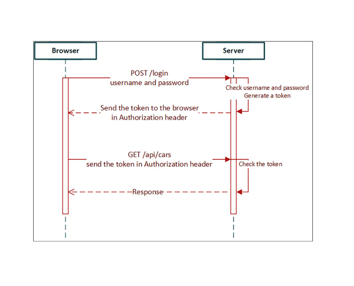

1. 복습 사항
  - 프론트 엔드에서의 CRUD 로직 - axios 활용
    - Get 요청 : axios.get()
      1. 전체 요청 : url만 있으면 됨
      2. 개별 요청 : url+id만 있으면 됨 - getCar()에서 매개변수로 전달
    - Delete 요청 : axios.delete()
      1. 전체 요청 : 가능하지만 구현하지는 않을것
      2. 개별 요청 : url + id만 있으면 됨. - deleteCar()에서 매개변수 전달
    - Post 요청 : axios.post()
      1. axios.post(arg1, arg2, arg3); 형태로 이용, id 없음
        - arg1 : url
        - arg2 : post 요청을 보내는 애를 객체 형태로
        - arg3 : headers 등을 포함한 메타 데이터
    - Put 요청 : axios.put()
      1. axios.put(arg1, arg2, arg3);
        - arg1 : url + id - 특정 항목을 수정하기 위해 고유값 포함(edit같은 행동)
        - arg2 : 수정 사항 내용을 포함한 객체 형태(put이기 때문에 객체가 다 작성되어야 함)
        - arg3 : headers를 포함한 메타데이터

2. 현재 상황
  1. backend 에서 SecurityConfig를 수정했기 때문에 /login 엔드포인트에서의 POST 요청을 제외한 모든 부분에서 authorization을 요구함
    - frontend server on했을 때 가능
    - postman을 이용할 경우 사전에 /login 엔드포인트로 user / user 혹은 admin / admin을 통해서 jwt를 발급받고, 그걸 authorzation 탭에 복사 붙여넣기 해두면 요청이 가능
    - heidiSQL에서는 인증 없이 가능 : db 처음 접속할 때 username / password를 통과했기 때문에

# Frontend Protection
- /login 엔드포인트에 대해서 POST 요청을 보낼 수 있는 frontend의 작성이 요구된다.


- 이후 모든 요청에 대해서 발급받은 token(jwt)을 headers의 authorization 부분에 토큰을 담아서 진행하게 된다.

## Login 컴포넌트 생성
1. components 폴더에 Login.tsx를 생성 후 초기화

```tsx
import axios from "axios"; // post용
import { useState } from "react";
import { Button, TextField, Stack } from "@mui/material";

type User = {
  username : string,
  password : string
}

export default function Login(){

  const [user, setUser] = useState<User>({
    username: '',
    password: ''
  });
  const [isAuthenticated, setAuth] = useState(false);

  const handleChange = (e : React.ChangeEvent<HTMLInputElement>) => {
    setUser({...user,[e.target.name] : e.target.value })
  }

  const handleLogin = () => {
    
  }

  return(
    <Stack spacing={2} alignItems='center' mt = {2}>
      <TextField name='username' label='사용자 이름' onChange={handleChange}></TextField>
      <TextField name='password' label='비밀번호' onChange={handleChange}></TextField>
      <Button
        variant="outlined"
        color="primary"
        onClick={handleLogin}
      ></Button>
    </Stack >
  )
}
```

- 6번 까지의 지시사항을 바탕으로, textfield가 두 개 필요하다(handleChange가 필요하다)는 것을 알게 되었다. 그리고 버튼을 눌렀을 때만 POST 여청이 가야하기 때문에 handleLogin이라고 하는 함수가 필요하다는 것도 당연한 수순이다.

- handleLogin()은 /login 엔드포인트에 대해 POST 요청을 날려야 하는데, 버튼을 눌렀을 때 발동해야한다. `() => {}` 구조라는 의미. axios.post() 요청의 경우 arguments 구조를 작성했었다. endpoint도 알고, 나머지도 이미 템플릿이 되어 있다.

- addCar()를 참조하여 작성

1. 동기적 작성
```tsx
const handleLogin = async () => {
    try {
      //1. 요청 전송 및 응답 대기
      const response = await axios.post(`${import.meta.env.VITE_API_URL}/login`,{user} ,{
      headers: {
    'Content-Type': 'application/json',
      }
    })

      // 2. 응답 헤더에서 토큰 추출
      const jwtToken = response.headers.authorization;

      // 3. 토큰 존재 여부 확인 및 상태 업데이트
      if(jwtToken !== null && jwtToken !== undefined){
        localStorage.setItem('jwt', jwtToken); // 브라우저에 jwt 토큰 저장
        setAuth(true); // 리액트 상태에서 인증되었다고 바꿔줌
      }
    } catch(err) {
      console.error('로그인 중 에러 발생 : ', err);
    }
  }
```

2. 비동기적 작성
```tsx
const handleChange = (e : React.ChangeEvent<HTMLInputElement>) => {
    setUser({...user,[e.target.name] : e.target.value })
  }

  const handleLogin = () => {
    axios.post(import.meta.env.VITE_API_URL + '/login',user ,{
      headers: {
        'Content-Type' : 'application/json'
      }
    }).then(res => {
      const jwtToken = res.headers.authorization;
      if(jwtToken !== null && jwtToken !== undefined){
        localStorage.setItem('jwt',jwtToken);
        setAuth(true);
      }
    }).catch(err => {
      console.log('로그인 중 오류 발생 :',err)
    })
  }

```

```tsx
import axios from "axios"; // post용
import { useState } from "react";
import { Button, TextField, Stack } from "@mui/material";
import Carlist from "./Carlist";

type User = {
  username : string,
  password : string
}

export default function Login(){

  const [user, setUser] = useState<User>({
    username: '',
    password: ''
  });
  const [isAuthenticated, setAuth] = useState(false);

  const handleChange = (e : React.ChangeEvent<HTMLInputElement>) => {
    setUser({...user,[e.target.name] : e.target.value })
  }

  const handleLogin = () => {
    axios.post(import.meta.env.VITE_API_URL + '/login',user ,{
      headers: {
        'Content-Type' : 'application/json'
      }
    }).then(res => {
      const jwtToken = res.headers.authorization;
      if(jwtToken !== null && jwtToken !== undefined){
        localStorage.setItem('jwt',jwtToken);
        setAuth(true);
      }
    }).catch(err => {
      console.log('로그인 중 오류 발생 :',err)
    })
  }

  if(isAuthenticated){
    return <Carlist/>
  } else {
    return(
    <Stack spacing={2} alignItems='center' mt = {2}>
      <TextField name='username' label='사용자 이름' onChange={handleChange}></TextField>
      <TextField name='password' label='비밀번호' onChange={handleChange}></TextField>
      <Button
        variant="outlined"
        color="primary"
        onClick={handleLogin}
      >로그인</Button>
    </Stack >
      )
  }
}
```

- 이상까지 작성했을 때 localStorage에 jwt key가 생성되었고, Carlist 컴포넌트를 불러오려고 시도했을 때 실패한다면 의도한대로 구현된 것입니다. 그렇다면 왜 오류가 발생하는가?<br>
getCars() 함수를 호출 할 때 token이 담겨있지 않다는 것은 여전하기 때문이다. 
getCars()함수가 있는 carapi.ts를 수정해야한다.<br>
axios.get() 요청시 토큰을 담아야한다.<br>
`{headers : {'Authorization':token}}`

- 토큰 미포함시
```ts
export const getCars = async () : Promise<CarResponse[]> => {
    const response = await axios.get(`${import.meta.env.VITE_API_URL}/api/vehicles`);//

    return response.data._embedded.cars;
  }
```
- 그러면 토큰을 가지고 와야 한다. 그런데 react는 props drilling을 통해서 단방향으로만 data flow가 일어난다. 근데 얘는 애초에 함수만 분리해서 확장자가 .ts이다. 즉, 상태가 넘어가지 않는다.

- 토큰 포함시
```ts
export const getCars = async () : Promise<CarResponse[]> => {
    const token = localStorage.getItem('jwt');
    const response = await axios.get(`${import.meta.env.VITE_API_URL}/api/vehicles`,{
      headers:{
      'Authorization' : token,
    }});//

    return response.data._embedded.cars; 
  }
```

- 전체 수정 버전

```ts
import {CarResponse} from '../types'
import axios from 'axios'
import { Car , CarEntry} from '../types';

// GET
export const getCars = async () : Promise<CarResponse[]> => {
    const token = localStorage.getItem('jwt');
    const response = await axios.get(`${import.meta.env.VITE_API_URL}/api/vehicles`,{
      headers:{
      'Authorization' : token,
    }});
    return response.data._embedded.cars; // cars까지 해야 list가 나온다. 스프링데이터 레스트-> 웹에 컨트롤러를 안만들어도 되는것이 장점
    //스프링 데이터 레스트를 왜~! 주의해야 할까
  }

// Delete
export const deleteCar = async (link:string) => {//id가 포함된 url
  const token = localStorage.getItem('jwt');
  const response = await axios.delete(link,{
      headers:{
      'Authorization' : token,
    }});// db로찍었을때 id가 long으로 바뀌기 때문에 아직 string, 즉 리액트에선 string, 스프링부트에서 long id가 된다. 물론 우린 _links.~~해서 그런거지 항상 그런건 아니다.
  return response.data;
}

//POST
export const addCar = async (car: Car) => {
  const token = localStorage.getItem('jwt');
  const response = await axios.post(`${import.meta.env.VITE_API_URL}/api/vehicles`, car, {
    headers: {
      'Content-Type' : 'application/json',
      'Authorization' : token
    }
  })// 인자가 2개, 첫번째는 url, create에는 id가 없다.
  return response.data;
}

// PUT 요청
export const updateCar = async (carEntry: CarEntry): Promise<CarResponse> => {
  const token = localStorage.getItem('jwt');
  const response = await axios.put(carEntry.url, carEntry.car, {
    headers:{
      'Content-Type' : 'application/json',
      'Authorization' : token
    }
  })

  return response.data;
}
```

- 현재의 수업 내용에서 axios를 이용한 CRUD에서 token을 추가하여 authorized하는 방법을 작성했다. 그런데 token을 불러온느 지역변수가 너무 많다. 동일한 부분이 반복되고 있다는 것을 확인할 수 있는데, 코드 반복을 피하도록 템플릿을 작성하도록 하겠다.

```ts
import {CarResponse} from '../types'
import axios from 'axios'
import { Car , CarEntry} from '../types';
import { AxiosRequestConfig } from 'axios';

const getAxiosConfig = () : AxiosRequestConfig => { // 전역 변수로 선언해서 사용
  const token = localStorage.getItem('jwt');

  return{
    headers: {
      'Authorization' : token,
      'Content-Type' : 'application/json',
    }
  }
}

// GET
export const getCars = async () : Promise<CarResponse[]> => {
    //const token = localStorage.getItem('jwt'); 원랜 이걸 일일이 쳐서 getAxiosConfig()자리에 headers를 적어야 했다.
    const response = await axios.get(`${import.meta.env.VITE_API_URL}/api/vehicles`,getAxiosConfig());
    return response.data._embedded.cars; // cars까지 해야 list가 나온다. 스프링데이터 레스트-> 웹에 컨트롤러를 안만들어도 되는것이 장점
    //스프링 데이터 레스트를 왜~! 주의해야 할까
  }

// Delete
export const deleteCar = async (link:string) => {//id가 포함된 url
  //const token = localStorage.getItem('jwt');
  const response = await axios.delete(link,getAxiosConfig());// db로찍었을때 id가 long으로 바뀌기 때문에 아직 string, 즉 리액트에선 string, 스프링부트에서 long id가 된다. 물론 우린 _links.~~해서 그런거지 항상 그런건 아니다.
  return response.data;
}

//POST
export const addCar = async (car: Car) => {
  const response = await axios.post(`${import.meta.env.VITE_API_URL}/api/vehicles`, car,getAxiosConfig())// 인자가 2개, 첫번째는 url, create에는 id가 없다.
  return response.data;
}

// PUT 요청
export const updateCar = async (carEntry: CarEntry): Promise<CarResponse> => {
  const response = await axios.put(carEntry.url, carEntry.car,getAxiosConfig())

  return response.data;
}
```

- 이상은 AxiosRequestConfig 자료형을 도입하여 getAxiosConfig 함수를 정의하고 각 CRUD에 포함시켰습니다. 공통된 지역변수 부분을 바깥으로 빼내어서, 함수의 호출을 통해서 반복적으로 코드를 줄이면서 유지보수성 및 코드 가독성을 향상시켰다.(외국인 기준으로 향상)

- AxiosRequestConfig : Axios 라이브러리에서 HTTP 요청을 만들 때 사용되는 구성으로 return 타입은 'JS 객체'에 해당한다. 즉, Axios를 경유하여 요청을 보내기 위해 필요한 모든 옵션(headers 뿐만 아니라 다른 메타 데이터를 포함하여)을 다는 일종의 interface에 해당한다.(Java의 인터페이스가 아니다)

## 오류메세지 표시
- 로그인 과정에서 authentication에 실패할 경우 Snackbar를 통해 토스트 메시지를 띄우도록 한다.
- Snackbar를 import 해야하고, 모달처럼 요구하는 상태가 있었다.(오픈?) 두가지 지시 사항 처리

## 로그아웃
- 버튼을 클릭했을 때, jwt를 삭제하도록 할 예정, `localStorage.setItem('jwt','').setAuth(false);`

- 처음 디폴트 엔드포인트로 들어가면 Login 컴포넌트가 나오는 상태이다.
<br> 거기서 authentication이 완료가 되면 Carlist 컴포넌트가 렌더링된다. 그러면 로그아웃 버튼 자체는 Carlist에 있어야 하는데 handleLogout 함수는 어디에 있어야 하는가?
- userState가 login에 있어서 Login.tsx에 있어야 한다... 근데 다른 방식은 없나
- 아무튼 그 함수를 Carlist로 props drilling 즉, 전달해줘야한다.

```tsx
// components/carlist.tsx
import { useQuery , useMutation, useQueryClient} from "@tanstack/react-query";
import {getCars, deleteCar} from '../api/carapi'
import { DataGrid, GridCellParams, GridColDef, GridToolbar } from "@mui/x-data-grid";
import {  Snackbar, Button, IconButton, Tooltip, Stack } from '@mui/material';
import { DeleteForeverRounded } from "@mui/icons-material";
import { useState } from "react";
import AddCar from "./AddCar";
import EditCar from "./EditCar";

type CarlistProps = {
  logout? : () => void;
}

export default function Carlist({logout}:CarlistProps){//
  const queryClient = useQueryClient();
  const [open,setOpen] = useState(false);

  const columns: GridColDef[] = [
    {field: 'brand', headerName: '브랜드', width:100,},
    {field: 'model', headerName: '모델', width:100},
    {field: 'color', headerName: '색깔', width:100},
    {field: 'registrationNumber', headerName: '등록번호', width:100},
    {field: 'modelYear', headerName: '제작년도', width:100},
    {field: 'price', headerName: '가격', width:100},
    {
      field : 'edit',
      headerName: '',
      sortable: false,
      filterable: false,
      disableColumnMenu: true,
      renderCell: (params: GridCellParams) => <EditCar cardata={params.row}/>
    }
    ,
    {
      field: 'delete',
      headerName: '',
      filterable: false,
      disableColumnMenu: true,
      renderCell: (params: GridCellParams) => (//GridCellParams의 아래에 있는 row,
        <Tooltip title='delete car'>
          <IconButton aria-label="delete" size="small"
          onClick={() => {
            if(confirm(`${params.row.brand}의 ${params.row.color} ${params.row.model}을 삭제하겠습니까?`))
          {
            mutate(params.row._links.self.href)
          }
        }}
        >
            <DeleteForeverRounded/>
          </IconButton>
        </Tooltip>
      )
    }
  ]//배열, 자꾸 헷갈려서 리스트라 적었는데
  const { data, error, isSuccess } = useQuery({
      queryKey: ['cars'],
      queryFn: getCars
  })

  const {mutate} = useMutation(deleteCar,{
    onSuccess: () => {
      setOpen(true);
      queryClient.invalidateQueries({ queryKey: ['cars']}); // 쿼리 무효화, useQuery는 캐싱과 매우 밀접한 연관이 있는데, 캐시에 삭제된 정보가 계속 남아있기 때문에 쿼리를 무효화 할 필요가있다.
      //자동차 삭제 후 실행, 리렌더링 되게 바꾸고 싶다.
    },
    onError: err => {
      console.log(err);
    }
  }) // mutate를 이용해 호출

  if(!isSuccess){
    return <span>Loading ...</span>
  } else if(error){
    return <span> 자동차 데이터를 가져오던 중 오류가 발생했습니다.</span>
  } else {
    return(
      <>
        <Stack direction='row' alignItems='center' justifyContent='space-between'>
          <AddCar/>
          <Button onClick={logout}>로그아웃</Button>
        </Stack>
        {/* <AddCar/> */}
        <DataGrid
          rows={data}
          columns={columns} //car각각이 json형태로 저장된 배열
          disableRowSelectionOnClick={true} // 클릭한 라인이 파란색으로 잡히는걸 막는다.
          getRowId={row=> row._links.self.href}//고유값 집어넣어야함 ,근데 어떻게 이걸 들고 올 수 있는거지
          //row는 매개변수, 인자는 rows에 저장된 data 하나하나
          slots={{toolbar: GridToolbar}}
        />
        <Snackbar
          open={open}
          autoHideDuration={2000} 
          onClose={() => setOpen(false)}
          message='해당 차량 정보가 삭제되었습니다.'
        />
      </>
    );
  }
}

```
- 현재 우리는 Login 컴포넌트를 지나면 곧장 Carlist로 들어가고, Post요청이나 PUT 요청인 경우에 Dialog가 렌더링되는 등 기본적으로 Carlist 내부에서 결판나는 상황이기 때문에 Carlist 컴포넌트 내부에 Log Out 버튼이 존재한다. 하지만 여러 페이지로 구성된 복잡한 프론트엔드로 디자인 했다면 AppBar 컴포넌트에 로그아웃 버튼을 렌더링하여 각 페이지마다 표시되게 하는게 좋을 것이다. 거기서 끝이 아니라 AppBar에서 하위 컴포넌트들로 연속적으로 props drilling을 해야 할텐데, 현재 구조를 보면 그것도 불가능하다는 것을 알 수 있다. 그 때 이용하는것이 `전역관리` -> ContextAPI 혹은 Zustand를 사용해야 한다.

- 게시물에 좋아요 개수를 추적했는데 마이페이지에서 내가 받은 좋아요 개수 총합 같은거 집어넣었을 때는 like상태 역시 전역적으로 관리되어야 한다.

# OAuth2 설정 Back-Front 프로젝트

korit_12_oauth2
## backend 프로젝트 설정